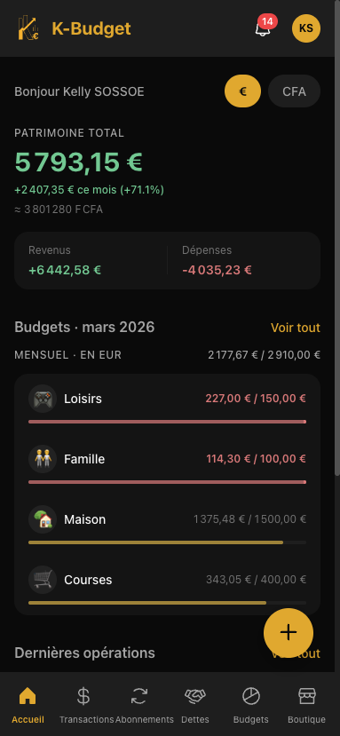
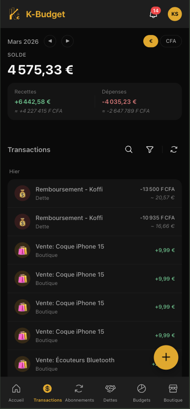
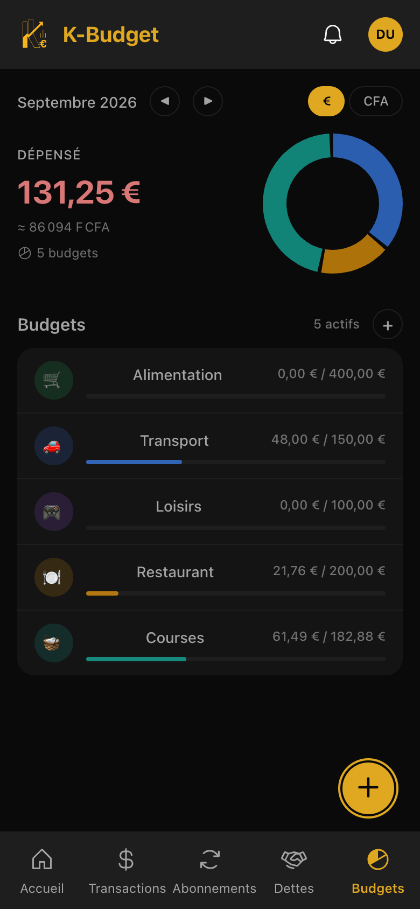
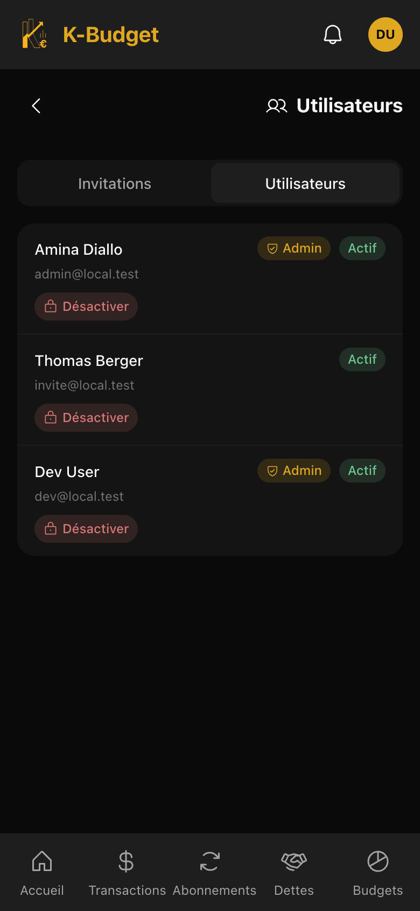

# k-budget

Gestion de budget auto-hebergee, concue pour ceux dont l'argent ne vit ni dans
un seul pays ni dans une seule devise.

Suivez depenses, abonnements, dettes et budgets sur plusieurs comptes et
plusieurs devises. Tourne sur votre serveur. Aucun compte chez nous, aucune
donnee qui sort de votre machine, aucune telemetrie.

> 🇬🇧 [English version](README.md)

<p>
  
  
  
  
</p>

## Pourquoi ce projet

La plupart des applications de budget supposent un pays, une devise, et une
banque a laquelle elles savent parler. Cette hypothese s'effondre des que votre
vie s'etend sur plusieurs endroits.

k-budget repose sur trois choix :

- **Plusieurs devises, traitees a egalite.** EUR, XOF, USD, GBP, CHF, CAD, MAD.
  Les soldes s'agregent par devise, sans faire semblant de tout convertir dans
  une seule.
- **Les banques ouest-africaines au meme rang que les autres.** Ecobank,
  Orabank, UBA, Coris, NSIA, Bank of Africa cotoient BNP Paribas, Credit
  Agricole et Revolut. Les agregateurs bancaires ne couvrent pas cette zone, et
  les projets etablis de budget auto-heberge non plus.
- **Import CSV plutot qu'API bancaires.** L'open banking exige un
  intermediaire agree, ce qu'un projet auto-heberge ne peut pas etre. Les
  profils d'import decrivent comment lire l'export d'une banque donnee, et sont
  faits pour etre contribues.

**L'application est multi-utilisateurs.** Une instance sert plusieurs
personnes : l'onboarding se fait par invitation d'un administrateur, avec des
roles, une isolation stricte des donnees par utilisateur et un garde-fou contre
la suppression du dernier administrateur actif. Il n'y a pas d'inscription
publique, et c'est delibere.

## Fonctionnalites

- **Transactions** — Depenses et recettes, saisie en deux ou trois taps, bilan
  mensuel, transactions recurrentes, virements entre comptes
- **Abonnements** — Vue centralisee, total mensuel, paiement en un clic,
  historique
- **Dettes et prets** — Remboursements partiels ou totaux, rappels
  configurables, multi-devises, inclusion optionnelle dans le solde
- **Budgets** — Par categorie (hebdomadaire, mensuel, annuel), seuil d'alerte
  configurable, snapshots mensuels, detection des depenses hors budget
- **Import CSV** — Resolution du profil bancaire, previsualisation,
  dedoublonnage Jaro-Winkler, regles de categorisation par motif
- **Comptes** — Courant, epargne, especes. 28 banques (France, Togo,
  international). Solde total agrege par devise
- **Personnalisation** — Fonctionnalites activables, ordre de navigation,
  devise principale, taille du texte, notifications

## Stack

| Couche         | Technologie                                    |
|----------------|------------------------------------------------|
| Backend        | Java 21, Spring Boot 4.0.2, Maven, Flyway      |
| Web            | Angular 21, TypeScript 5.9, SCSS               |
| Mobile         | Flutter ≥ 3.27, Dart ≥ 3.6, Riverpod, Drift    |
| Base de donnees| PostgreSQL 15+                                 |
| Auth           | Spring Security + JWT                          |
| Infra          | Docker + Caddy (HTTPS automatique)             |

PostgreSQL est la seule dependance d'infrastructure. Pas de broker de messages,
pas de serveur de cache, aucun service externe.

## Demarrer

**PostgreSQL est inclus.** Rien d'autre a installer.

```bash
git clone https://github.com/sopequenoteck/kbudget.git
cd budget
cp .env.example .env
```

Renseignez les deux valeurs obligatoires dans `.env` — tout le reste a un
defaut utilisable tel quel :

```bash
openssl rand -base64 48    # a coller dans JWT_SECRET
                           # puis choisir un DB_PASSWORD
```

```bash
docker compose up -d
```

L'interface est sur **http://localhost:8080**. Changez `APP_PORT` dans `.env`
si ce port est deja pris.

**Au premier demarrage**, un compte administrateur est cree et son mot de passe
genere s'affiche une seule fois dans les logs de l'API :

```bash
docker compose logs api | grep -A4 "FIRST BOOT"
```

> **Notez-le tout de suite.** Ce mot de passe n'est affiche qu'au tout premier
> demarrage et n'est stocke que hashe : il est irrecuperable ensuite. A la
> connexion, il vous sera demande de definir vos propres identifiants.

Vous avez deja un serveur PostgreSQL a utiliser ? Copiez
`docker-compose.override.yml.example` vers `docker-compose.override.yml` et
renseignez `DB_URL` dans `.env`.

Les images sont publiees pour `linux/amd64` et `linux/arm64` — Raspberry Pi
4/5, NAS ARM, instances ARM cloud et Apple Silicon fonctionnent sans build
local.

<details>
<summary>Sans Docker</summary>

```bash
psql -c "CREATE USER budget_u WITH PASSWORD 'changeme';"
psql -c "CREATE DATABASE budget_db OWNER budget_u;"

cp .env.example .env

cd api && mvn spring-boot:run -Dspring-boot.run.profiles=dev
cd app && npm ci && ng serve
```

</details>

Pour HTTPS, les mises a jour, la sauvegarde et la restauration, et le
depannage, voir [`docs/deployment.fr.md`](docs/deployment.fr.md).

## L'application mobile

L'application Flutter est un logiciel libre. **Vous pouvez la compiler
vous-meme depuis ce depot, et ce build est fonctionnellement identique a celui
des stores** — rien n'est bride selon l'origine du binaire.

Elle est aussi vendue sur les stores. L'y acheter finance le projet : cela
achete la commodite et les mises a jour, pas des fonctionnalites.

## Structure du projet

```
budget/
├── api/         # Backend Spring Boot (API REST)
├── app/         # PWA Angular
├── flutter/     # Application mobile native
├── deploy/      # Caddyfile, units systemd, scripts
├── docs/        # Documentation technique
└── scripts/     # Utilitaires
```

## Documentation

| Document | Contenu |
|----------|---------|
| [`.specify/memory/constitution.md`](.specify/memory/constitution.md) | **Constitution du projet** — principes fondateurs. Fait autorite sur toute autre documentation |
| [`docs/architecture.md`](docs/architecture.md) | Decisions techniques, securite, modele de donnees, structure frontend |
| [`docs/vision.md`](docs/vision.md) | Vision produit et modules fonctionnels |
| [`docs/api-examples.md`](docs/api-examples.md) | Exemples de requetes et reponses par endpoint |
| [`docs/api-errors.md`](docs/api-errors.md) | Contrat d'erreurs HTTP |
| [`docs/api-compatibility.md`](docs/api-compatibility.md) | **Politique de compatibilite d'API** — les six regles d'ecriture et la procedure de rupture assumee |
| [`docs/deployment.fr.md`](docs/deployment.fr.md) | **Exploiter une instance** — installation, HTTPS, mises a jour, sauvegarde et restauration, depannage |
| [`DESIGN.md`](DESIGN.md) | Reference design : principes, couleurs, patterns, tokens |
| **Swagger UI** | `http://localhost:8080/api/swagger-ui.html` — profil `dev` uniquement |

## Contribuer

Les contributions sont bienvenues. **Les profils d'import bancaire sont le
point d'entree le plus utile**, et ne demandent pas de Java : decrire le format
d'export CSV de votre banque sert a tous ceux qui y sont clients.

Toute pull request doit etre couverte par le [CLA](CLA.md) — signature par
commentaire, rien a imprimer ni a envoyer. [`CONTRIBUTING.md`](CONTRIBUTING.md)
explique comment lancer le projet, ce qui est attendu d'un changement, pourquoi
le CLA existe et ce qu'il n'implique pas.

En participant, vous acceptez le [Code de conduite](CODE_OF_CONDUCT.md).

Une faille de securite ? Lisez [`SECURITY.md`](SECURITY.md) et signalez-la en
prive plutot qu'en ouvrant une issue.

## Licence

Ce depot applique **deux licences selon le repertoire**. Verifiez laquelle
s'applique avant de reutiliser du code.

| Repertoire | Licence | Fichier |
|------------|---------|---------|
| `api/` — backend Spring Boot | **AGPL-3.0-only** | [`LICENSE`](LICENSE) |
| `app/` — frontend Angular | **AGPL-3.0-only** | [`LICENSE`](LICENSE) |
| `flutter/` — application mobile | **MPL-2.0** | [`flutter/LICENSE`](flutter/LICENSE) |

Tout autre fichier du depot (racine, `docs/`, `deploy/`, `scripts/`,
`.github/`) est couvert par l'**AGPL-3.0**, a l'exception des elements recenses
dans [`NOTICE`](NOTICE).

### Pourquoi deux licences

**AGPL-3.0 sur le serveur et le client web.** Sa clause reseau impose de
publier ses modifications a quiconque exploite le logiciel comme service. Elle
existe pour empecher un tiers de prendre ce backend, de le fermer et d'en faire
le service heberge que ce projet a choisi de ne pas etre.

**MPL-2.0 sur l'application mobile.** Les conditions de distribution de l'App
Store — gestion des droits numeriques, limitation du nombre d'appareils — sont
incompatibles avec GPL et AGPL. VLC en a fait les frais en 2011, retire de
l'App Store et revenu seulement apres son passage en MPL. La MPL-2.0 est un
copyleft **par fichier** : qui modifie un fichier doit le republier, mais peut
ajouter du code a cote. La protection tient, sans le conflit.

Les deux coexistent sans se contredire : un client qui dialogue en HTTP avec un
serveur n'est pas une oeuvre derivee de ce serveur.

### Nom et logo

**Le nom « k-budget » et le logo du projet sont reserves** et ne sont couverts
par aucune des deux licences. Les licences portent sur le code, pas sur
l'identite. Un fork est libre d'exister — sous un autre nom et un autre logo,
afin qu'on ne puisse pas le confondre avec ce projet.

### Actifs tiers

Les logos d'etablissements bancaires et la police Inter appartiennent a leurs
titulaires respectifs et **ne sont couverts par aucune des deux licences**. Ils
sont recenses dans [`NOTICE`](NOTICE).

Les logos sont presents en deux exemplaires, un par client :
`api/src/main/resources/static/bank-logos/` et `flutter/assets/banks/`. La
police Inter est sous SIL Open Font License 1.1, dont le texte est joint dans
[`flutter/assets/fonts/Inter/OFL.txt`](flutter/assets/fonts/Inter/OFL.txt) et
embarque dans l'application distribuee.

> Cette section decrit des choix de licence, elle ne constitue pas un avis
> juridique.
